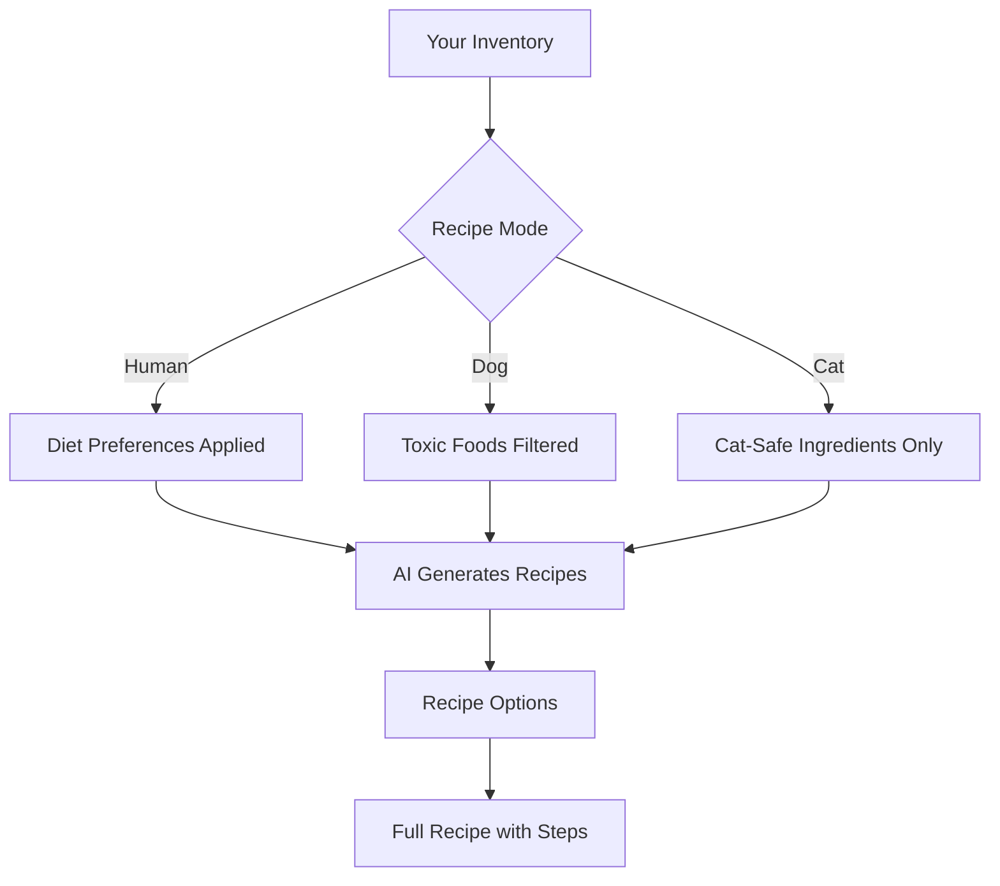

# SAVR AI Features: Visual Scanning & Smart Recipe Generation

# SAVR Complete AI Experience

Building the core intelligence that makes SAVR magical — scan your kitchen, build your inventory, and get personalized recipes instantly.

---

## What You'll Get

### 1. Smart Kitchen Scanner
Capture your ingredients with your camera or upload photos. SAVR will identify everything automatically.

**Scanning Zones:**
- Refrigerator (fresh produce, dairy, meats)
- Pantry (dry goods, canned items, snacks)
- Spice rack (seasonings, herbs, oils)
- Freezer (frozen items, ice cream, meats)

**How it works:**

**Features:**
- Real-time camera capture with guided overlay
- Batch photo upload for multiple storage areas
- Confidence indicators showing how sure AI is about each item
- Easy correction if AI misidentifies something
- Automatic category sorting (produce, protein, dairy, etc.)

---

### 2. Intelligent Inventory Management

Your digital pantry that knows what you have and when it expires.

**Smart Features:**
- Auto-categorization of scanned items
- Expiry date estimation based on item type
- "Use Soon" alerts for items about to expire
- Quick manual add with autocomplete suggestions
- Quantity tracking with smart unit conversion

---

### 3. AI Recipe Generation

The heart of SAVR — turning your ingredients into delicious meals.

**What you'll see:**
- Conversational AI chat interface
- Recipe cards with photos, time, difficulty
- Step-by-step cooking instructions
- Nutritional information
- Substitution suggestions
- "I'm missing X" shopping prompts

---

### 4. Shopping Mode: Expand Your Options

Don't have enough for a full meal? SAVR suggests what to buy.

**The Experience:**
1. AI analyzes your current inventory
2. Shows recipes you're "almost" able to make
3. Lists 1-3 missing ingredients per recipe
4. One-tap to add items to your shopping list
5. Grouped by store section for efficient shopping

**Example:**
> "You have chicken, rice, and garlic. Add **coconut milk** and **curry paste** to make Thai Green Curry!"

---

### 5. Real-Time Cooking Assistant

Your AI sous chef while you cook.

- Voice-friendly step reading
- Timer integration for each cooking step
- "Help! What do I do?" panic button
- Substitution suggestions mid-recipe
- Portion scaling calculator

---

## Visual Experience

### Scanner Interface
- Full-screen camera with scanning grid overlay
- Animated scanning indicator while AI processes
- Items appear as floating tags on the image
- Satisfying "pop" animation as each item is identified
- Swipe to confirm or dismiss items

### AI Chat Interface
- Message bubbles with typing indicator
- Recipe cards that expand inline
- Quick-reply suggestion chips
- Smooth scroll with sticky header
- Pet mode indicator always visible

### Recipe Cards
- Hero image with gradient overlay
- Cooking time, difficulty, servings at a glance
- Dietary tags (vegan, gluten-free, etc.)
- Heart to save, share button
- "Start Cooking" prominent action

---

## Pet Safety Integration

When in Dog or Cat mode:

- **Automatic filtering** of toxic ingredients (chocolate, grapes, onions, garlic, xylitol, etc.)
- **Visual warnings** if you try to add unsafe items
- **Vet disclaimer** on every pet recipe
- **Simplified preparations** appropriate for pet treats

---

## New Screens to Build

| Screen | Purpose |
|--------|---------|
| **Scanner** | Camera capture + photo upload for inventory |
| **Scan Results** | Review AI-identified items before adding |
| **AI Chat** | Conversational recipe generation |
| **Recipe Detail** | Full recipe with ingredients, steps, nutrition |
| **Cooking Mode** | Step-by-step cooking assistant |
| **Shopping List** | Missing ingredients + grocery organization |
| **Grocery Suggestions** | "Almost recipes" with missing items |

---

## Technical Notes (for reference)

- Uses OpenAI Vision API for image analysis
- LLM powers recipe generation and chat
- All AI calls go through secure Edge Functions
- Images processed but not stored long-term
- Works offline for viewing saved recipes

---

## Summary

This update transforms SAVR from a recipe app into a true **AI kitchen companion** that:

1. **Sees** what's in your kitchen (visual scanning)
2. **Knows** your inventory and preferences
3. **Creates** personalized recipes on demand
4. **Helps** you shop smarter when needed
5. **Guides** you through cooking step-by-step

Ready to build this premium experience?